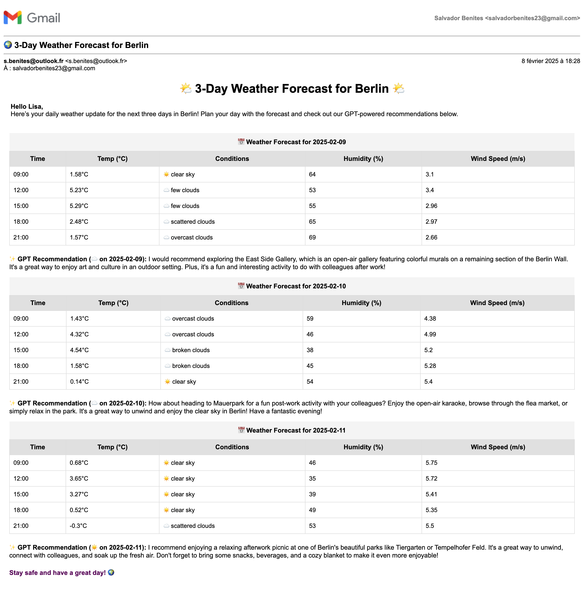

# WeatherApp

## 🌍 Overview
**WeatherApp** is a Python-based application that **fetches a 3-day weather forecast** for Berlin and **sends it via email**  using **AW SES** every day at **8:00 AM**. It includes an **AI-powered recommendation** for after-work activities based on the weather forecast.

---

## 🚀 Features
✅ Fetches **3-day weather forecasts** from the **OpenWeatherMap API**  
✅ Includes **GPT-powered** after-work **recommendations** using **OpenAI**  
✅ Sends **formatted weather reports** as an **HTML email**  
✅ Runs **automatically via cron** every morning at **8:00 AM**  
✅ **Disables itself after 14 days** to avoid infinite scheduling  

---

## 📧 Sample Email
Below is an example of the email sent by the WeatherApp:



---

## 📁 Folder Structure
```
WeatherApp/
├── main.py                  # Main entry point of the application
├── weather_forecast.py      # WeatherForecast class (fetches weather data)
├── gpt_recommendation.py    # GPTRecommendation class (AI-powered suggestions)
├── email_notifier.py        # EmailNotifier class (handles email sending)
├── utils.py                 # Utility functions (e.g., weather icons)
├── config.py                # Configuration file (retrives API keys & settings from env var)
├── disable_cron.sh          # Script to remove the cron job after 14 days
├── cron.txt                 # Documentation for cron job setup
├── logs/                    # Stores logs for debugging & monitoring
│   ├── cron.log             # Logs from the cron job execution
│   └── cron_removal.log     # Logs from cron job removal
├── requirements.txt         # Python dependencies
└── README.md                # Project documentation
```

---

## 🛠️ Setup and Installation

### 1️⃣ Clone the Repository
```bash
git clone https://github.com/SalvadorBenz23/weatherapp.git
cd weatherapp
```

### 2️⃣ Install Dependencies
```bash
pip install -r requirements.txt
```

### 3️⃣ Configure Environment Variables
To set up your environment variables, run the following commands:
```bash
export OPENWEATHER_API_KEY="your_openweathermap_api_key"
export OPENAI_API_KEY="your_openai_api_key"
export SENDER_EMAIL="your_email@example.com"
export RECEIVER_EMAIL="recipient_email@example.com"
export AWS_SES_USER="your_ses_user"
export AWS_SES_PASS="your_ses_password"
export SMTP_SERVER="email-smtp.eu-west-3.amazonaws.com"
export SMTP_PORT=587
```

### 4️⃣ Set Up Cron Jobs
#### Add a Cron Job
1. Open the crontab editor:
   ```bash
   crontab -e
   ```
2. Add the following line to schedule the job at 8 AM daily:
   ```
   0 8 * * * /usr/bin/python3 /path/to/WeatherApp/main.py >> /path/to/WeatherApp/logs/cron.log 2>&1
   ```

#### Schedule Automatic Removal
Schedule the `disable_cron.sh` script to run after 14 days using `at` or another cron job:
```bash
echo "/path/to/WeatherApp/disable_cron.sh" | at 08:01 AM `date -d "14 days" '+%Y-%m-%d'`
```

---

## 📌 Usage
1. Ensure all dependencies are installed and all the env vars are properly set for `config.py`.
2. Run the application manually to test:
   ```bash
   python3 main.py
   ```
3. Confirm that the weather report email is received successfully.

---

## ⚙️ Development

### 🛠 Adding Features
- Add new functionalities by creating additional classes or modules.
- Follow the folder structure for modular code organization.

### ✅ Testing
- Ensure unit tests are written for each class and helper function.
- Use `pytest` for running tests.

### 🔍 Observability
- Log all critical events, such as API errors and email failures, to `logs/cron.log`.
- Monitor the application’s behavior using these logs.

---

## 🤝 Contributing
1. Fork the repository.
2. Create a new feature branch.
3. Commit your changes and push them to your fork.
4. Submit a pull request.

---

## 📜 License

For any questions or feedback, please contact **Salvador Benites** at **s.benites@***.fr**.
